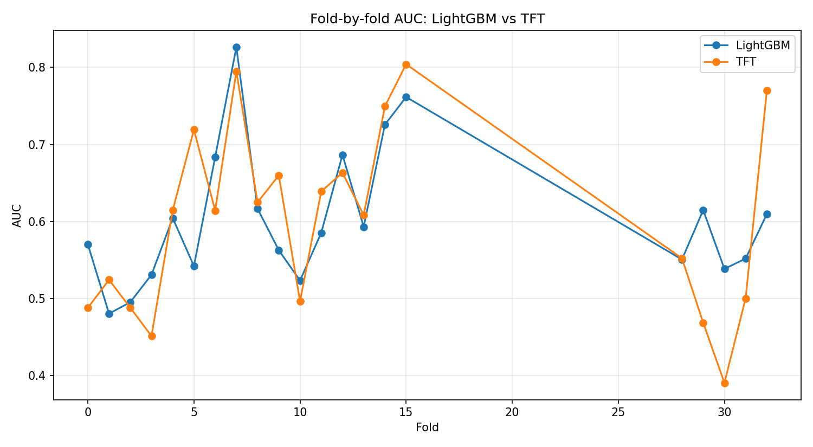
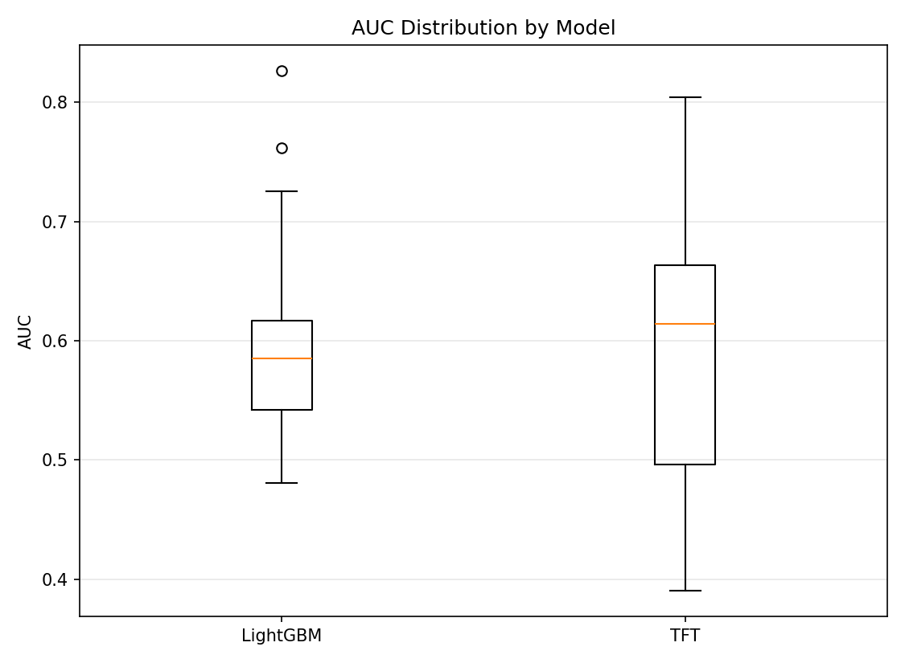
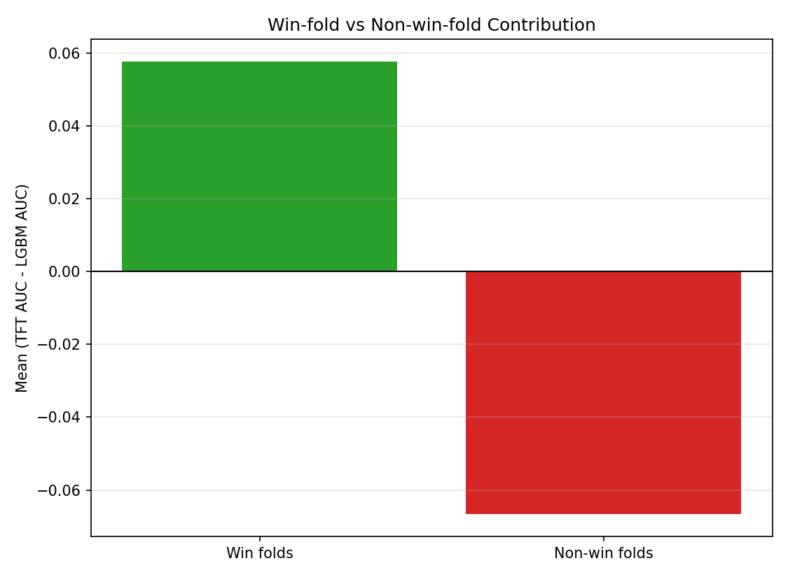
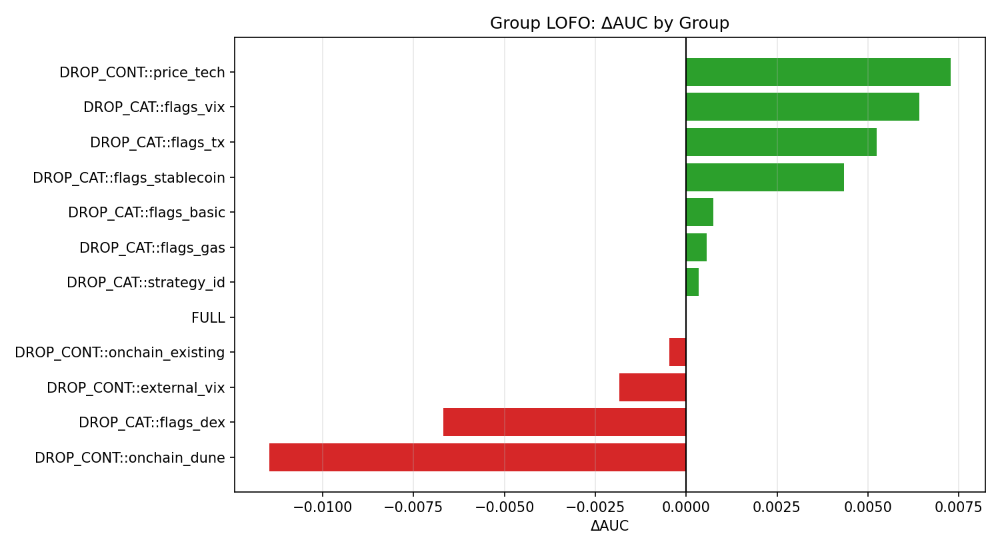
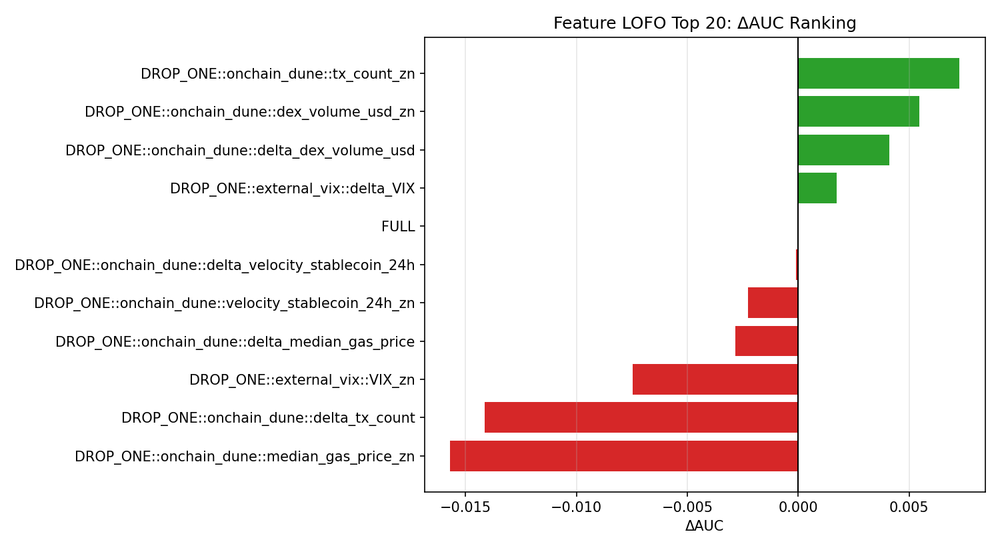

# 金融時系列予測における TFT vs LightGBM

このポートフォリオプロジェクトでは、**Temporal Fusion Transformer（TFT）** と **LightGBM** を、複数の金融時系列ドメインにまたがって、整合性のある fold ベースの評価設定で比較しています。現時点で、このリポジトリには以下 2 つの検証済み実験が含まれています。

- **暗号資産（Crypto）予測**: 平均性能では両モデルはほぼ拮抗
- **株式（Stock）予測**: 評価した設定では TFT が平均的に優位

## Executive Summary

このプロジェクトの主目的は、「どちらのモデルが常に優れているか」を主張することではありません。むしろ、**ドメイン・fold・特徴量群によってモデルの振る舞いがどう変わるか**を明らかにすることです。

| ドメイン | 評価の見方 | TFT | LightGBM | 要点 |
| --- | --- | ---: | ---: | --- |
| Crypto | Walk-forward AUC | Mean AUC = 0.601 | Mean AUC = 0.603 | 平均ではほぼ同等。TFT はレジーム依存的な勝ち方を示した。 |
| Stocks | 5-fold の整合比較 | Mean AUC = 0.5815 | Mean AUC = 0.5127 | この設定では TFT が平均で LightGBM を上回った。ただし fold ごとの差は残る。 |

実務上の重要な示唆は、**モデル選択と特徴量の効き方は、ドメインとアーキテクチャの両方に依存する**という点です。Crypto では強い表形式ベースラインが非常に競争力を保ちました。一方で Stocks では、同じ評価枠組みの中で TFT がより強い平均シグナルを捉えました。

## Project Overview

金融予測は、データがノイジーで非定常であり、しばしばレジーム変化の影響を受けるため難しい問題です。ある期間や資産クラスでうまくいくモデルが、別の状況でも同じように一般化するとは限りません。

本プロジェクトでは、その問題を以下 2 つの異なるモデリングアプローチの比較を通じて検証しています。

- **Temporal Fusion Transformer（TFT）**: 時系列文脈を活用するシーケンスモデル
- **LightGBM**: 特徴量エンジニアリングを前提とした、強く解釈しやすい表形式ベースライン

この比較が重要なのは、両モデルがシグナル表現に対して異なる前提を持つからです。

- TFT は時系列文脈・変数間相互作用・時間とともに変化する構造を活用しやすい
- LightGBM は、有効な情報が手作り特徴量に十分要約されているときに非常に強い

したがって、本プロジェクトの目的は単なるスコア比較ではありません。主に次の問いに答えることを目指しています。

1. 各モデルは fold をまたいでも安定しているか
2. 性能はドメインや市場レジームに依存するか
3. どの特徴量群が有用で、どれが冗長または有害になり得るか

## Motivation

金融 ML では、単一の集約指標だけを見ると重要な振る舞いを見落としやすい、という問題があります。

2 つのモデルが平均スコアでは近くても、実際には次のように大きく異なる場合があります。

- 片方はより安定している
- 片方は限られた期間で大きく勝つ
- 両者が依存している特徴量空間が異なる

そのため、この README では以下を明確に分けて整理しています。

- **全体の fold レベル比較**
- **fold-by-fold の詳細**
- **LOFO ベースの解釈**

この構成にすることで、単なるポートフォリオ資料としてだけでなく、ML / Data Science 面接での技術的な説明素材としても使いやすくしています。

## Modeling Approach

### Models

- **TFT**: 時系列予測向けに設計された、動的な特徴量相互作用を扱えるシーケンスモデル
- **LightGBM**: 構造化特徴量に強い勾配ブースティングのベースライン

### Feature perspective

本プロジェクトは、単にアーキテクチャを比較するだけでなく、**各アーキテクチャがより豊かな金融特徴量にどう反応するか**も見る設計になっています。実験全体を通じて、価格由来特徴量・マーケット特徴量・マクロ特徴量・文脈依存のシグナルを組み合わせています。

ここでの仮説は慎重です。**特徴量を増やせば自動的にすべてのモデルが良くなるわけではない**、という立場を取っています。

## Evaluation Design

### Walk-forward と fold ベース評価

本プロジェクトでは、ランダム分割ではなく、**時系列の順序を保った評価**を採用しています。

Crypto 実験では、主な評価方法として **walk-forward validation（WFA）** を使っています。

1. ある時点までの過去データで学習する
2. その直後の未見期間で評価する
3. 時間窓を前進させてこれを繰り返す

Stock 実験では、TFT と LightGBM を **整合した fold 設定** で比較し、公平な fold 単位比較になるようにしています。

### Why AUC

主指標は **AUC（Area Under the ROC Curve）** です。タスクが方向性の分類問題であり、単一閾値での accuracy ではなく、**fold をまたいだ順位付けの質**を比較したかったため、AUC を採用しています。

### Why regime-aware interpretation

金融データは定常ではありません。ボラティリティ、トレンド、流動性、マクロ環境が変わることで、特徴量とターゲットの関係も変化します。そのため、特に Crypto では、モデル性能を **レジームを意識した視点** で解釈しています。

## Crypto Results

### Overall fold-level comparison

Crypto 実験では、walk-forward 評価の下で TFT が強い特徴量ベースラインを上回れるかを検証しました。

| 指標 | TFT | LightGBM |
| --- | ---: | ---: |
| Mean AUC | 0.6010 | 0.6030 |
| Mean ΔAUC (TFT - LGBM) | -0.0015 | — |
| TFT の勝率 | ~52% | — |

結論として、**Crypto では平均性能はほぼ同等**でした。Mean AUC では LightGBM がわずかに上回りましたが、TFT は fold の過半数で勝っています。これは、一方が一貫して支配的だったというより、**競っているが均一ではない**プロファイルを示しています。

### Fold-by-fold detail

以下の図は、walk-forward の各 split におけるモデルの挙動を示しています。

重要なのは、平均値が近くても fold ごとの挙動は一致しない、という点です。

- **安定性**: LightGBM は全体を通して競争力を維持している
- **分散**: TFT は一部 fold で相対的な上振れがあるが、それが全 fold に一様に出ているわけではない

このため、平均差だけでは十分に解釈できません。

### Distribution comparison

分布の比較は、平均値ではなく**頑健性**を捉えるのに役立ちます。

ばらつきが小さいほど fold をまたいだ一貫性が高いと解釈できます。一方で、ばらつきが大きい場合は上振れと下振れの両方を持っている可能性があります。Crypto では、この分布比較も「平均では近いが、結果の出方は同じではない」という結論を補強しています。

### Win vs non-win analysis

この図は、TFT が LightGBM に勝った fold と負けた fold を分けて見たものです。

この図は**補助的な診断**として有用です。Crypto における TFT の性能が **レジーム依存的** であることを示唆しています。

- TFT が大きく勝つ fold がある
- 一方で、TFT が大きく負ける fold もある

このパターンにより、TFT が fold 勝率ではやや優勢でも、Mean AUC では LightGBM に近い、あるいはわずかに下回ることが説明できます。

### LOFO-based interpretation

#### Group level

グループ単位の LOFO は、特徴量グループ全体を除外したときに性能がどう変わるかを見ます。

ΔAUC が正なら、そのグループが有益である可能性を示します。弱い、あるいは負の寄与であれば、そのグループが冗長・ノイズ・不安定である可能性があります。これは、どの特徴量ファミリーを残し、簡略化し、再設計するべきかを考える上で役立ちます。

#### Feature level

特徴量単位の LOFO は、各特徴量を除外したときの ΔAUC を見ます。

Crypto では、この結果から **on-chain 特徴量が意味のあるシグナルを持っていそうだ** という、慎重ながら重要な示唆が得られます。ただし、LOFO は因果的な重要度ではなく、あくまで **性能感度分析** として解釈すべきです。

## Stock Results

### Overall fold-level comparison

Stock 実験では、同じモデル比較が異なる金融ドメインでどう変わるかを見ています。

| 指標 | TFT | LightGBM |
| --- | ---: | ---: |
| Mean AUC | 0.5815 | 0.5127 |
| Std AUC | 0.0511 | 0.0155 |
| Mean ΔAUC (TFT - LGBM) | 0.0689 | — |
| TFT の fold 勝利数 | 4 / 5 | — |
| 最大 ΔAUC の fold | Fold 2 | — |
| 最小 ΔAUC の fold | Fold 3 | — |

この 5-fold の整合比較では、**TFT が平均で LightGBM を上回りました**。これが Stock 実験の主結果です。ただし、fold ごとの差は残っており、「常に TFT が優れている」とまでは言えません。あくまで、**この設定では平均的な優位が見られた** と解釈するのが適切です。

また、LightGBM は依然として重要な比較対象です。解釈しやすく強力なベースラインであり、それを上回ること自体に意味があります。

### Fold-by-fold detail

Stock の fold-by-fold 結果は以下の通りです。

| Fold | TFT AUC | LightGBM AUC | ΔAUC (TFT - LGBM) |
| ---: | ---: | ---: | ---: |
| 0 | 0.585650 | 0.505614 | 0.080036 |
| 1 | 0.584992 | 0.515848 | 0.069143 |
| 2 | 0.613839 | 0.504185 | 0.109654 |
| 3 | 0.486788 | 0.496575 | -0.009787 |
| 4 | 0.636347 | 0.541082 | 0.095265 |

この表から分かる重要な点は以下です。

- TFT は **5 fold 中 4 fold** で勝利
- 相対差が最も大きかったのは **fold 2**
- TFT が下回ったのは **fold 3**

したがって、Stock 実験は **TFT の平均的な優位** を支持しますが、その優位はすべての fold で一様に現れたわけではありません。

### LOFO-based interpretation

Stock の LOFO 結果は、アーキテクチャごとの特徴量依存を理解するうえで有用です。

**TFT** の上位 LOFO 特徴量には以下が含まれます。

- `fred_DGS10_ret1`
- `ATR_14`
- `volume`
- `log_volume`
- `ret_1_rolling_mean_20`
- `trend_60_120`
- `log_ret_5`
- `log_ret_1`
- `yf_^GSPC_close_ret1`
- `ma_120`

**LightGBM** では、より静的・要約的な handcrafted feature への依存が強いことが示唆されます。

- `ma_120`
- `ATR_14`
- `ret_1_rolling_mean_20`
- `log_volume`
- `fred_term_spread_10y_2y`
- `fred_DGS10_ret1`
- `yf_^VIX_close_ret1`
- `yf_^GSPC_close_ret1`

一方で、LightGBM では一部特徴量を除外した方が性能が改善するケースもありました。例として以下が挙げられます。

- `log_ret_1`
- `mkt_trend_regime_id`
- `log_ret_5`
- `ma_120`

この点から、一部特徴量は LightGBM にとって冗長、あるいは有害であった可能性があります。

保守的にまとめると、次のように言えます。

- **TFT は、市場・マクロ・時系列文脈を含むより豊かな特徴量の組み合わせから恩恵を受けやすいように見える**
- **LightGBM は、要約的に設計された handcrafted feature の定義により強く依存する、強い tabular baseline として振る舞うように見える**

## Cross-Domain Comparison

2 つの実験を並べて見ることで、単独の実験より多くの示唆が得られます。

| 観点 | Crypto | Stocks |
| --- | --- | --- |
| 平均的なモデル比較 | ほぼ拮抗。Mean AUC は LightGBM がわずかに上 | 評価設定では TFT が平均で明確に上回る |
| Fold の振る舞い | 競争力はあるがレジーム依存的 | TFT は多くの fold で勝つが、一様ではない |
| 解釈 | 強いベースラインを一貫して上回るのは難しい | シーケンスモデルの平均優位がより明確 |
| 特徴量の示唆 | On-chain 情報が有効そう | 特徴量とアーキテクチャの相互作用がより明確 |

これらの結果は、**モデル選択と特徴量の効き方はドメインとアーキテクチャに依存する** ことを示唆しています。これは本プロジェクト全体の中心的なモチベーションでもあります。

Stock 実験から得られる簡潔な結論は、**同じモデル比較でも金融ドメインが変わると結論が変わり得る** という点です。このケースでは、Crypto よりも Stocks の方が TFT の平均的優位をより明確に示しました。

## Key Takeaways

- **TFT が常に LightGBM より優れているわけではない**。Crypto では平均でほぼ同等、Stocks では TFT がより優位だった。
- **Fold レベルの分析が重要**。平均指標だけでは、安定的な勝ちなのか、一部期間での上振れなのかが分からない。
- **LightGBM は依然として強いベンチマーク**。この比較が意味を持つのは、そのベースライン自体が強いから。
- **特徴量の効き方はモデル依存**。Stock の LOFO は、TFT と LightGBM が同じ特徴量空間を異なる形で利用している可能性を示唆した。
- **LOFO は診断ツールとして有用**。有用・冗長・有害な特徴量を見つけるのに役立つが、因果的解釈には使うべきではない。

## Repository Structure / Reproducibility

Crypto 側の figure 生成では、以下のような artifact を想定しています。

- `tft_vs_lgbm_compare.csv` — TFT と LightGBM の fold 単位 AUC 比較テーブル
- `tft_vs_lgbm_summary.json` — 比較の集約サマリ指標
- `lofo_group_agg.csv` — 特徴量グループ単位の LOFO ΔAUC
- `lofo_feature_agg.csv` — 特徴量単位の LOFO ΔAUC

現在の README では、既存の Crypto 図を以下から埋め込んでいます。

- `reports/figures/run_real_compare_001/fig03_fold_auc.png`
- `reports/figures/run_real_compare_001/fig04_auc_dist.png`
- `reports/figures/run_real_compare_001/fig05_lofo_group_delta_auc.png`
- `reports/figures/run_real_compare_001/fig06_lofo_feature_topN_delta_auc.png`
- `reports/figures/run_real_compare_001/fig07_winfold_contrib.png`

一方で Stock セクションは、現時点ではリポジトリ上の図ではなく、**検証済みのサマリ結果と fold 単位結果** に基づいて記載しています。

## Future Work

- Stock 側にも Crypto と同様の可視化 artifact を追加する
- クロスドメインな ensemble が安定性を改善するか検証する
- LOFO を用いて弱い特徴量群をより体系的に削減・再構成する
- レジーム切替やアーキテクチャルーティング戦略を検討する
- より多くの金融ドメインと長い評価期間に拡張する
